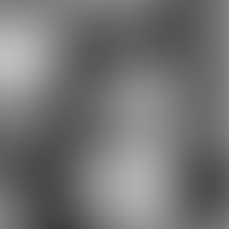
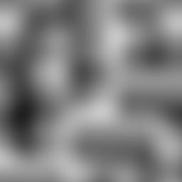
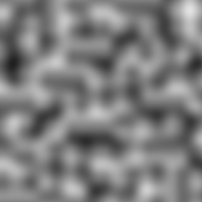
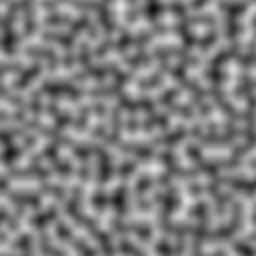

# MapGenerator
This project will build a command-line executable to manually generate noise maps. 

At the moment, these maps can be generated:
- Perlin noise

## Usage
```
Usage: MapGenerator.exe [OPTIONS]

Options:
  -h,--help                   Print this help message and exit
  -t,--type TEXT REQUIRED     Type of noise (Perlin / Worley)
  -o,--output TEXT REQUIRED   Output destination


```

## Update
#### 2019.8.18
Now able to generate Perlin noise with different sampling frequencies. The following images are some 256 x 256 noises with frequency 2, 4, 8, and 16 respectively.
| freq=2 | freq=4 | freq=8 | freq=16 |
| :----: | :----: | :----: | :-----: |
|  |  |  |  |