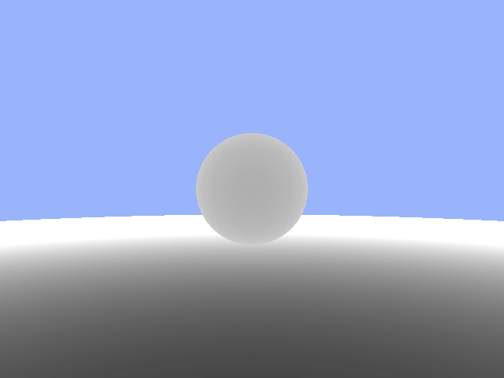
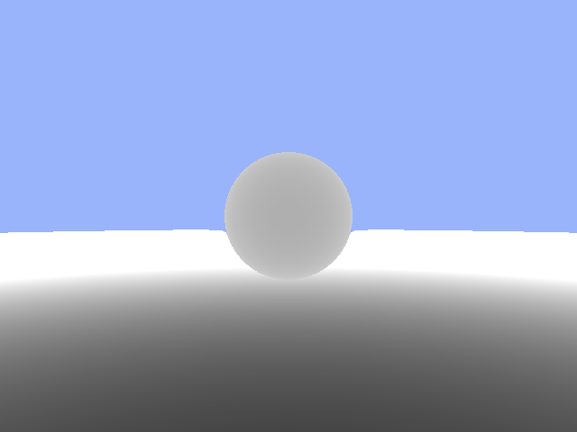
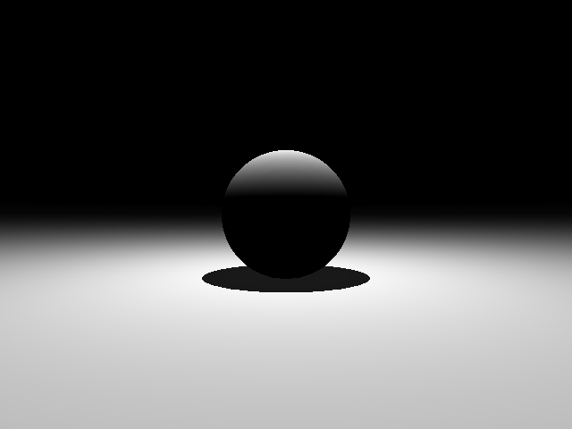

# VolumetricCloud
This project will launch an executable to showcase a real-time rendered volumetric cloud space scene.

## Update 
#### 2019.8.18
Implemented a simple ray marching algorithm and tested on different lighting environments. The following image speaks for itself.
| Fixed-steps | Sphere tracing | Diffuse lighting |
| :---------: | :------------: | :--------------: |
||||